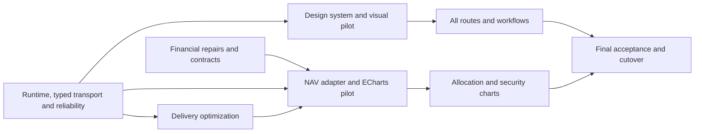

# Frontend Modernization Implementation Plan

> **For agentic workers:** REQUIRED SUB-SKILL: Use superpowers:subagent-driven-development (recommended) or superpowers:executing-plans to implement this plan task-by-task. Steps use checkbox (`- [ ]`) syntax for tracking.

**Goal:** Make the portfolio frontend reliable, coherent and modern across all screens, with an ECharts chart system that preserves the application's financial semantics.

**Architecture:** Retain Vue 3, Vite, Pinia and Vuetify. Introduce one committed portfolio-context coordinator and one latest-request lifecycle, then build consistent workspace components and typed domain boundaries around them. Repair the two confirmed chart calculation defects in separate reviewed changes; migrate rendering through a typed, backward-compatible chart contract and a NAV-first pilot.

**Tech Stack:** Existing Vue/Vite/Pinia/Vuetify/Axios/TypeScript; Node 24.20.0; Vitest and agent-browser verification; Apache ECharts with vue-echarts after the pilot dependency task; Django/Decimal/pytest through backend uv project mode.

**Spec:** [Accepted frontend audit](../../audits/2026-09-08-frontend-audit.md). The user accepted its findings and requested this plan. Preserve the established table choices in [18 August table design](../specs/2026-08-18-tables-visual-redesign-design.md).

**Status:** Implementation started on `codex/frontend-modernization` from current main `197b8df7`, following the user's execution request. R1 runtime/verification work is implemented and reviewed in `1b6d803c` and `c32c33e0`; R8 typed transport is implemented and reviewed in `92228fd8` and `e2153d1f`. R2 layout is implemented and reviewed in `9f69dede`. R3 committed context and session isolation are implemented and reviewed in `06184e43`, `8ae59291` and browser-gate repair `ef21af7f`; the deterministic backend test-fixture repair `dd8811be` passed full pytest and scoped review. R4 reactive dates is implemented and reviewed in `d12f66d5`, including mounted range regressions and the in-place settings date browser flow. R5 latest requests is implemented and reviewed in `886f430f`, `190ddcd6` and error-recovery fix `30f310d2`. R6 dashboard recovery is implemented and reviewed in `66f22c5e`, including isolated widget Retry, context/date invalidation and retained NAV rendering during updates. R7 delivery is implemented in c9711d33, 7c1473cc and a1ab7ff8, with three scoped review findings corrected through regressions. Final gates include 251 frontend tests, 72 browser route profiles, 30 dialog reopen flows, explicit failed-dialog-download recovery and 1261 backend tests. Complete cold dashboard delivery fell from 508589 to 322579 gzip bytes (36.57%); login/profile exclude chart modules and no full icon font is downloaded. F1/F2/F3 are separate draft financial-review PRs #46/#47/#48 with needs-approval; human approval before merge remains pending. D1 visual foundations are implemented and scoped-reviewed: semantic tokens, scoped defaults and page/section components; 253 frontend tests and 1261 backend tests passed. D2 context/navigation is implemented and scoped-reviewed with the Performance settings workflow finding corrected: complete context intents, named controls, responsive navigation and a scrollable page heading. Final gates include 262 frontend tests, 1261 backend tests and 72 browser route profiles. D3 rendered visual acceptance is next. Later milestones remain planned. The original audit was taken at `a25f1882`; implementation rechecks current source before each task. No merge or deployment is authorized by this status.

**Focused follow-up:** [Grouped tables and allocation pies](../../audits/2026-09-08-grouped-tables-and-allocation-pies.md) records the user's subsequent request. Three solid allocation pies are now an explicit requirement, superseding the August bar-chart decision. The hybrid table presentation is the recommended design for the existing D3/D4 pilot: a compact single-row Overview, comparison presets, and a two-row grouped Full ledger. This recommendation is not an implemented or separately approved visual result.

## Global Constraints

- Retain Vue 3, Vite, Pinia and Vuetify; do not repeat the already-completed Vue CLI/Vuex/script-setup migration.
- Keep current URLs, backend ownership of financial calculations, authentication behavior, account/group semantics and existing import capabilities.
- Always use `Decimal` for money/price math — never `float`.
- Internal precision: >= 6 decimal places for prices, >= 9 for quantities/FX.
- Rounding: `ROUND_HALF_UP`. Persisted aggregates: 2 dp. UI: per `CustomUser.digits` or default 2.
- Convert raw values to JavaScript numbers only at the plotting boundary. Do not calculate authoritative returns, NAV, FX or cash-flow decomposition in the frontend.
- Preserve zero, negative, null, unavailable and incomplete values distinctly. An unknown valuation must not become zero to make a chart render.
- Preserve grouped metric meaning, sticky row identity, all existing columns/totals and functional server sorting. Evaluate the focused hybrid recommendation in D3/D4: fully named single-row Overview columns; Entry & valuation/exit comparison presets; quiet two-row grouped Full ledger; no third logical header tier. The prior two-row-everywhere presentation is no longer an inflexible constraint.
- Dashboard Asset Type, Asset Class and Currency allocations must become three solid pie charts, with accurate chart/table alternatives. The separate NAV timeline retains stacked bars and both IRR lines.
- Light theme is the first release: existing brokerage blue, neutral work surfaces, system font and tabular numerals. Dark mode, localization, shared saved-view URLs, new keyboard-shortcut systems and CSV export UI are follow-ups, not prerequisites.
- Chart.js stays available until the ECharts pilot and every live-chart acceptance case pass. No runtime dual rendering or double data calculation for ordinary users.
- No DB schema migration, production restart, production deployment or live account mutation is part of this planning task.
- Financial changes require a separate PR, expected Decimal regression results, `needs-approval` and appropriate financial/risk labels, and explicit human review before merge. The user accepted the audit direction; that does not replace financial PR review.
- Execute backend commands from `backend/` using `uv run`; execute frontend npm commands from `frontend/`. Retain both frontend package declarations/lockfile and backend pyproject/uv.lock together whenever their dependencies change.
- Follow the repository's `agent-browser` requirement for browser automation. Use isolated synthetic fixtures and sessions; never add a production authentication bypass or public test route.
- All application changes need the repository pytest gate; focused tests help local iteration but do not substitute for required full verification. Document pre-existing/environmental failures; never silently waive them or report green.

## Plan package and ownership

This document controls ordering, shared decisions and release acceptance. The three linked plans contain exact existing/proposed files, interface definitions, test examples, implementation steps and per-task verification commands. Read this master plus the relevant workstream before implementation.

| Workstream | Detailed plan | Ownership |
|---|---|---|
| R — Reliability and platform | [frontend-reliability-platform.md](2026-09-08-frontend-reliability-platform.md) | Runtime/tests, basic shell offset, committed context, date reactivity, request ordering, retries, delivery size, API/type boundaries. |
| F/C — Financial correctness and charts | [chart-correctness-echarts.md](2026-09-08-chart-correctness-echarts.md) | Numerical repairs, chart metadata, adapter, NAV pilot, accessible chart interactions, remaining chart migration and cutover. |
| D — Design and workflows | [frontend-design-workflows.md](2026-09-08-frontend-design-workflows.md) | Tokens/components, context presentation, navigation, dashboard hierarchy, tables/forms/all routes, import and large-workflow decomposition. |

Parallel implementation should use separate `codex/` worktrees/branches. Read the relevant worktree skill at execution time. Never have two agents edit `App.vue`, `stores/app.ts`, `services/api.ts`, `package.json` or the lockfile concurrently. Queue those integration changes, rebase onto prerequisites and review the final combined diff. New feature directories can proceed independently against agreed contracts.

## Runtime and verification baseline

Pin **Node 24.20.0** in `frontend/.node-version` and use that file in both CI workflows. Set the compatible package engine range to `>=24.20.0 <25`, with the exact file pin governing reproducible builds. Future patch upgrades are ordinary maintenance PRs. Node's current release page lists v24 as LTS and v20 as EOL; the current Vite/Vitest/jsdom package engine ranges accept v24. [Node releases](https://nodejs.org/en/about/previous-releases), [Vite requirements](https://vite.dev/guide/)

The earlier audit used Node 26.8.1. Its 85 passing/22 failing unit tests are a diagnostic baseline, not an accepted permanent exemption. R1 must identify and repair test-storage initialization under the chosen runtime, distinguish real app regressions from harness behavior, and make the full test suite deterministic. Do not assume switching Node alone fixes the failures.

R1 also creates a small `npm run test:browser` gate backed by the agent-browser CLI. Browser fixtures belong under `frontend/tests/browser/`; they supply complete endpoint shapes for every route exercised, avoiding the partial-fixture errors encountered during the audit. Unit tests can stub focused dependencies, but layout, focus and interaction acceptance uses real Vuetify components in a browser.

## Shared architecture decisions

### One committed financial context

R owns `frontend/src/types/portfolioContext.ts` and `frontend/src/stores/portfolioContext.ts`. The context includes a monotonically increasing revision, account selection, effective date, reporting currency and display precision. The coordinator exposes committed context, pending/error/readiness state, `changeContext(...)` and `reconcileContext()`; `stores/app.ts` initially remains a compatibility facade.

Account/settings changes are serialized because the existing backend persists context. Stop dependent reads during a transition and invalidate old generations when it begins. On acknowledged success, publish a coherent context and refresh once. On an unambiguous rejected mutation, retain the prior committed context and show a useful error. After an ambiguous timeout, reconcile the server's state before presenting new results; do not assume the backend rolled back because a client request was aborted.

D's context strip displays names/date/currency and emits intents to this coordinator. It does not persist preferences or initiate a competing context update. C snapshots the same context into chart request parameters. This prevents different screens from developing separate definitions of the active portfolio.

### One latest-request primitive

R owns `frontend/src/composables/useLatestRequest.ts`. Its public contract is `useLatestRequest<TParams, TData>(fetcher, snapshot)`, exposing readonly data/error/loading plus `run(params)` and `invalidate()`. Transport receives an AbortSignal; the accepted/discarded result determines whether dependent rows/totals can commit.

Cancellation is a resource optimization; generation/context checks are the correctness guarantee. Snapshot every parameter and include context revision. Do not commit stale results or clear newer loading/error state. Different queries must never be deduplicated only because some request is in flight. Keep a cache library out of this phase; add caching only after mutation invalidation is defined and measured.

### Domain transport and compatibility

R splits transport into typed domain modules while preserving `services/api.ts` exports during migration. Transport returns data/errors; it does not push routes, mutate Pinia stores or dispatch browser events. C owns chart types/adapters/renderers under `frontend/src/features/charts/`. D owns `components/workspace/` plus extracted import/broker/security workflows.

Use actual endpoint responses when designing adapters, not stale generated schema aliases or the audit's illustrative data. The current dashboard summary is a direct dictionary with `Current NAV`, `Invested`, `Cash-out`, `total_return` and `irr`; preserve and explicitly map those existing values. Do not introduce a Cash metric by renaming Cash-out, or hide total return during the visual change.

Type new boundary modules strictly and migrate high-value consumers incrementally. A rename of every JavaScript file is not a deliverable. Existing return and payload compatibility must be tested before removing the facade.

### Financial contract and chart identity

The chart API evolves additively: keep legacy chart fields for old clients, expose raw decimal values/statuses, stable server-issued category IDs, explicit units and ISO date/period metadata for the new adapter. Never infer an account identity from its visible label or infer exact dates from strings such as `Q1 2026`.

The current legacy account breakdown groups by display name. Preserve that grouping during parity work; authoritative membership-derived IDs may identify those legacy groups without silently splitting them. Any change to economic grouping is a separate behavior change.

Preserve since-inception XIRR, interval XIRR, the first interval point's inception behavior, thousands scaling and all contribution identities. Rename the displayed interval series clearly, but do not change its horizon to trailing twelve months. Zoom is a view operation and must not average returns or sum NAV snapshots.

Allocation pies represent the stated whole only when backend metadata confirms complete, nonnegative categories and a positive total. Keep signed/unavailable/partial/nonpartition data in the table with an explanatory pie state; never take absolute values, omit negatives, manufacture an Other residual or renormalize a subset into 100%. Chart.js allocation bars are a temporary migration fallback, not the target design. See C4 for pie geometry, denominator and legend acceptance.

## Implementation sequence and dependencies

The release milestones are ordered. Individual tasks within a milestone are separately reviewable; work on independent files may proceed in parallel.

| Milestone | Tasks / deliverable | Dependencies and release gate |
|---|---|---|
| 1 — Reliable baseline | R1 tests/runtime; R8 typed transport foundation; R2 header layout; R3 context, R4 dates, R5 requests and R6 retries. | R8 follows R1 and precedes R3/R5 to keep new context code free of the legacy router/store/API import cycle. R2 can proceed beside R8. All reproduced UI/context failures have behavioral tests and pass. F1/F2 and design token planning can run beside these tasks. |
| 2 — Financially correct chart input | F1 date alignment; F2 contribution boundary; F3 percentage-scale investigation; C1 additive metadata/error contract. | F1/F2 independent financial PRs. C1 follows approved repairs. F3 must be resolved before allocation migration; no unknown scale silently normalized. |
| 3 — Lean shared foundation and visual pilot | R7 delivery, D1 tokens, D2 context/navigation, D3 dashboard reference and D4 table/action patterns. | R state/transport contracts stable. D3 can use the existing chart renderer; it does not wait for ECharts. Review actual desktop/mobile dashboard plus a dense positions table before propagating the visual system to every route. |
| 4 — ECharts NAV pilot | C2 adapter and C3 NAV renderer with HTML legend/table, shared tooltip and zoom; D dashboard integration. | Depends on C1 plus R5/R8 contracts. Chart.js remains the default/fallback until parity, accessibility and performance gates pass. |
| 5 — Complete route/chart rollout | D5 all route families, D6 import extraction, D7 broker/security extraction; C4 allocations and security charts. | Reuse the accepted visual system. C4 depends on F3 resolution and C3 acceptance. Cover all route families, not only the dashboard. |
| 6 — Cutover and close | C5 ECharts default/removal gate, D8 final documentation and end-to-end acceptance. | All live charts migrated, numeric tests and UI checks pass, production build inspected and rollback reference recorded. No outstanding P1 audit finding. |



### First reviewable batch

- [x] R1: establish the supported runtime and trustworthy test gates.
- [x] R8: introduce the typed transport/context seam needed by the new state coordinator; retain legacy exports.
- [x] R2: fix header/content separation with a real-browser regression.
- [x] R3–R6: correct account context, dates, request ordering and retry recovery.
- [ ] F1 and F2: prepare the two financial fixes and their numeric evidence as separate PRs.

This batch provides value immediately. Do not postpone these fixes until the visual redesign or ECharts work is finished.

## Audit-to-task coverage

| Accepted audit finding | Owning tasks |
|---|---|
| P1-1 Header obscures content | R2 fixes geometry; D2/D3 preserve it through redesign. |
| P1-2 Failed account changes mislabel data | R3 committed context; D2 displays pending/committed state correctly. |
| P1-3 Obsolete/dropped requests | R5 shared lifecycle; C2/C3 use it for charts. |
| P1-4 Stale date presets | R4 reactive dates, coordinated by R3. |
| P1-5 Retry does not recover / calculation failure looks empty | R6 widget recovery; C1 explicit API error/status contract. |
| P1-6 Mobile controls and context clipping | D2 shell/context, D3 composition, C3 chart controls, D8 verification. |
| P1-7 Unnamed controls / inaccessible charts | D2/D4 controls, C3/C4 chart data access, D8 keyboard checks. |
| P1-8 Category/date misalignment | F1 numerical regression and repair. |
| P1-9 Contribution boundary omission | F2 numerical regression and repair. |
| P2-1 Initial bundle / Vuetify / MDI | R7 measured delivery changes; C5 chart cutover budget. |
| P2-2 Incomplete CI protection | R1 test/runtime gates; R8 Vue/TS lint scope; D8 final verification. |
| P2-3 Weak TypeScript/API boundaries | R8 typed transport; C1/C2 chart model; D6/D7 workflow contracts. |
| P2-4 Large mixed-responsibility modules | R8 API domains, D6 import state/steps, D7 brokers/security detail. |
| P2-5 Dashboard/design-system hierarchy | D1/D3 design pilot, D4 shared patterns, D5 all-route rollout. |
| P2-6 Navigation/action clarity, preferences, debug and documentation | D2/D4/D5/D8; R7 development-only debug imports; R8 obsolete transport/event cleanup. |
| Additional planning risk: percentage scale | F3 bounded investigation; C1 declares raw scale; C4 requires chart/table consistency. |

## Full application coverage

| Surface | Required modernization and preserved behavior |
|---|---|
| Application shell / navigation | Correct main offset; named controls; visible portfolio/date/currency context; labeled desktop navigation; mobile drawer; route URLs and navigation guards preserved. |
| Dashboard | Dominant NAV and explicitly defined return metrics; NAV-first trajectory; three solid allocation pies (Asset Type, Asset Class, Currency) plus reconciliation; per-widget error/retry/loading/empty states. |
| Summary / account performance | Preserve grouped annual/YTD/all-time accounting, totals and calculation meanings; align numbers; sticky identity; bounded horizontal scrolling; clear relationship to Dashboard. |
| Open / closed positions | Pilot single-row Overview plus two-row grouped comparison/Full ledger; preserve all 20 open and 16 closed leaf metrics, totals, sorting/pagination and key-based pinned identity; qualify chooser labels and persist per-table preferences. |
| Transactions | Clear primary action and grouped occasional actions; consistent filters; accessible row actions; exact transaction identity in delete confirmation; preserve normal/FX/corporate-action/import workflows. |
| Brokers / accounts | Consistent lists/forms/errors; preserve provider and account-group behavior; broker-token workflow extraction with secret-free logging. |
| Securities / detail | Consistent list/detail layout; preserve holdings and prices; correct chart unit metadata including bond price as percent of nominal; chart lifecycle and account filters. |
| Prices / FX | Consistent data-management controls, import and validation states; correct latest-query handling; preserve server pagination and date semantics. |
| Profile / edit / settings | Consistent fields/buttons/error placement; atomic preference updates; focus management; retain existing profile/security capabilities. |
| Login / register | Same design tokens and accessible form behavior; auth/redirect behavior unchanged; chart libraries absent from initial auth-route requests. |
| Import and long-running dialogs | Explicit state transitions, progress, mapping, cancellation, disconnect and reconnect handling; no duplicate import submission; close/unmount cleanup; results/invalidation occur once. |

## Acceptance gates

### Correctness and domain behavior

- [ ] Failed account update cannot show account B's label above account A's data.
- [ ] Timed-out context mutations reconcile before subsequent reads; pending updates cannot interleave to create a mixed context.
- [ ] A→B requests resolving B→A leave B's data, totals and loading state intact; FX changed filters are eventually executed.
- [ ] Changing valuation date and then selecting YTD uses the new date without route navigation.
- [ ] Failed then successful retry removes the local error and reveals recovered content.
- [ ] No chart category shifts across dates; absence is not guessed to be zero.
- [ ] First-day/last-day contribution boundaries use the agreed interval and have Decimal regression values.
- [ ] Allocation percentages have a documented ratio/percentage scale and agree between chart and table. F3 is a source-identified investigation, not an already confirmed audit defect.
- [ ] Both IRRs and all seven NAV modes × five frequencies preserve their defined values, units, statuses and horizons.
- [ ] Existing API clients still read the legacy response during transition; new consumers handle absent/malformed metadata visibly rather than inventing values.

### Visual and interaction

- [ ] Test 1440×1000 desktop, 1024×768 tablet, 390×844 mobile and selected critical layouts at 200% text/zoom.
- [ ] Header never covers the first content heading or primary action. Page controls fit or intentionally scroll within their own region.
- [ ] Account/date/currency remain understandable on narrow layouts. Wide financial tables preserve identity and scroll inside a labeled region.
- [ ] Keyboard users can reach named controls, edit filters, toggle chart series, use the data table and close dialogs with focus returned to the trigger.
- [ ] Chart series are distinguished by labels/styles as well as color; numeric signs remain visible; normal text/control contrast is checked against WCAG AA.
- [ ] Asset Type, Asset Class and Currency use solid pies for eligible allocations; invalid pie contexts retain the complete signed/status table and an explanation. Legend focus cannot silently change the denominator. NAV remains stacked bars with two IRR lines.
- [ ] Overview and Full ledger preserve the same metric keys and financial values. Entry/current or entry/exit comparisons remain simultaneously available. Group/leaf/row associations, key-based sticky identity, unambiguous Columns labels and visible active sorting survive preset changes.
- [ ] Loading does not destroy chart interaction state. Legend/zoom state persists for compatible refreshes and resets deliberately for changed account/unit/range identity.
- [ ] Desktop/mobile reference captures cover dashboard, one dense table and representative forms before global propagation; final route matrix is fully checked.

### Performance

Audit baseline: initial JS 415.12 kB gzip, CSS 119.70 kB gzip, MDI WOFF2 403.21 kB. Rebaseline with the chosen Node version and identical fixtures before comparing implementation changes.

- [ ] Measure the entire cold-route dependency graph, including lazy chunks loaded immediately, rather than just the entry filename. Report separate login, dashboard, transactions and security-detail totals.
- [x] R7 engineering target: at least 25% lower cold-dashboard JS+CSS gzip than the approximately 535 kB audit baseline (target approximately 401 kB), with no full MDI font request. This is a target, not a promised result; a miss needs measured tradeoff review.
- [ ] Chart cutover target: complete dashboard JS+CSS gzip remains within the original approximately 535 kB baseline; any variance is explicitly justified. Auth/profile routes do not load chart chunks.
- [ ] Benchmark 250, 1,250 and 5,000 daily points with realistic category counts. Record median/p95 initial render, interaction and update times using the same browser/hardware and fixed fixture; compare engines on identical payloads.
- [ ] Separate backend calculation time, response transfer and client rendering. No server caching or financial aggregation change is justified solely by a client rendering benchmark.
- [ ] Verify no duplicate fetches, sockets or import submissions emerge after repeated route entry/exit and context changes.

## Verification commands at implementation time

Frontend working directory: `D:/Project Y/Portfolio management/frontend`.

```powershell
npm ci
npm run test:unit
npm run type-check
npm run type-check:reliability
npm run type-check:charts
npm run lint
npm run build
npm run test:browser
```

R1/R8 introduce and verify the browser script, strict reliability scope and comprehensive Vue/TS lint scope before these become required gates. C2 introduces the strict chart scope; require that command once its configuration lands. A lint command that skips the changed file types is not sufficient. Each detailed task also names focused commands to get fast failure feedback during implementation.

Backend working directory: `D:/Project Y/Portfolio management/backend`.

```powershell
uv sync --frozen
uv run python -m pytest
```

The full pytest command retains existing configuration and coverage requirements; financial tasks add targeted unit/integration fixtures plus >=90% coverage for the changed calculation scope. Do not use `--no-cov` or alter thresholds to make the final gate pass. Live-provider tests remain opt-in; verify configured tests do not target production before running. Use `uv run python run_uvicorn.py` only if an isolated backend is required for integration, with synthetic data and a recorded stop method.

Run focused tests first during editing, then one complete required gate per finalized PR. Repeat only after a material change or a relevant failure. Planning documents themselves do not execute or claim these future checks.

## Rollout, review and rollback

1. Keep behavior fixes, financial repairs, visual changes and dependency removal in separately reviewable commits/PRs. Reference the audit finding and exact regression example in each.
2. Financial PRs include a before/after numeric example and required review labels. Do not merge them automatically. Backend service extraction has already happened; protected function/financial-output rules still apply even where old documentation lists stale paths.
3. Introduce the chart contract additively before deploying consumers that require it. Enable ECharts through the C workstream's explicit release switch; keep renderer selection independent of calculation behavior.
4. On a chart-rendering regression, select the prior renderer/release; do not roll back numerical repairs or downgrade incomplete data to zero. Chart.js removal happens only after a separate cutover acceptance, with the prior verified release recorded for rollback.
5. Workflow extraction follows characterization tests; do not change imports, provider retries or persisted transaction semantics as incidental cleanup.
6. Update `.memory-bank/Tech details/frontend.md`, relevant chart/NAV documentation and `DEVELOPMENT.md` as their changes land. Record actual Node/tool commands, new ownership boundaries and the two IRR definitions. Link completed PRs and final screenshot/benchmark evidence from the master checklist.

## Completion definition

The modernization is complete when all audit P1 findings are resolved with evidence, every route family follows the accepted UI patterns, all six live chart instances pass parity/accessibility tests, required test/build/lint/type gates are green, and measured performance plus rollback evidence is available. A successful dashboard mockup or ECharts demo alone does not complete this plan.

No calendar estimate is asserted: the first baseline pass establishes test-environment and backend-regression work. Milestones have independent acceptance criteria so useful fixes can be reviewed and delivered without waiting for the whole program.
